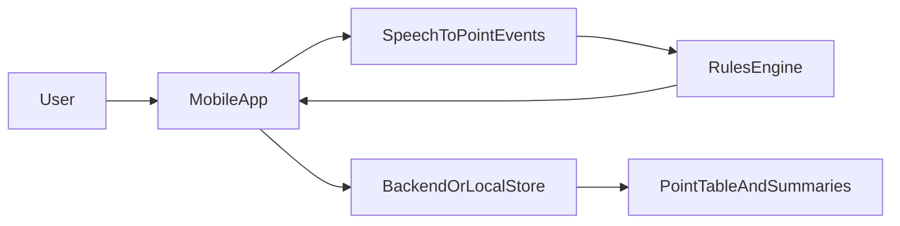

# PingPong logging expansion — planning

**Purpose:** Evolve the project from “read aggregate stats from a sheet and display them” into a **logging application**: start games from a **phone or iPad**, use **voice** during play, and record **point-by-point** data for richer metrics while still supporting **session-level** summaries.

**Status:** Active working draft. Core rules, GT workflow, batch audio scoring, and a local live-audio harness now exist in code. Product packaging, persistent storage, and the long-term platform strategy are still open. Do not put secrets here (sheet IDs, API keys, private URLs); use environment variables or local config only.

**Related:** See [structure.md](structure.md) for the current codebase layout and data flow.

---

## Vision

- **Scope:** Single-user / local use on your devices (phone, iPad) to run matches between two sides. Extensible later via named **Player 1 / Player 2** instead of only **V vs H**.
- **Relationship to the sheet:** Continue to store **final scores** in line with today’s spreadsheet-style aggregates, while adding **play-by-play** somewhere (see [Backend and data](#backend-and-data)). Exact integration (sheet only, DB only, or both) is **undecided**.

### Product versions

- **v1:** Run the system **manually on a computer** with the most basic frontend / operator UI possible. This version is primarily for validating the scoring loop, live-audio behavior, and data capture before investing in polished client apps.
- **v2:** Make the experience **platform-agnostic** so the same core scoring flow can be packaged for different frontends / devices (desktop, tablet, phone, or web) without rewriting the scoring logic from scratch.

---

## Game rules (authoritative for the app)

- **Win condition:** Play to **21** points; you must **win by 2**. If the score reaches **20–20**, play continues until one side leads by two (no cap).
- **Service rotation:** Service switches **every 5 points** starting from **0–0**, so (under normal play) the server changes on that cadence unless the game ends before the next switch.
- **Score call order (audio):** Before each point, the score is called **server first, then receiver**. When **service switches**, this **order flips** (e.g. after **10–4** if the **receiver** wins the point, the next call is **5–10**).
- **Real-world audio:** Callers sometimes say the order wrong and **correct themselves** shortly after; the system should support **corrections** (and tolerate transient mistakes) rather than assuming a single perfect utterance per point.

---

## Current baseline

- Today: Python (`backend/main.py`, `backend/app.py`) reads a Google Sheet via a service account, aggregates per-player stats, Flask serves JSON; React (Vite) displays summaries.
- **Current implementation progress:** The repo now includes a reusable **game rules engine**, GT validators, **audio -> predicted score table** batch scripts, transcript score parsing, WebRTC **VAD** support for local live audio, and a local live-score harness for manual desktop testing.
- **Near-term direction:** Before a polished mobile app, the first usable product pass should be a **desktop / laptop-run v1** with minimal UI and manual operator flow where needed. Once the end-to-end scoring loop is reliable, package that core flow into a **platform-agnostic v2**.

---

## Target user flows

### Session

1. **Configure matchup:** Choose **V vs H** (with a path to **Player 1 vs Player 2** labels later for extensibility).
2. **Warmup:** Optional **warmup period** — default **5 minutes**, or a **user-selectable** duration; skip is allowed if you add that control. **Warmup happens before** choosing who serves first.
3. **Game start / first server:** When warmup ends (or is skipped), the app **announces** via **audio** and **on-screen** that the game is starting, then you **select who serves first**. Input: **voice** and/or **touch UI**.
4. **During play:** The app **listens** to ongoing audio and **logs each point** into a **point-level table** (running score after each point, with enough metadata to reconstruct service side and call order if needed — exact schema TBD).
5. **Game over:** Show a **short summary**; then offer **another game** or **end session**.
6. **End session:** After one or many games (e.g. **1 or 5**), end the session and show an **overall session** view: record, duration, and other stats (**exact metrics TBD**).

### Edge cases to design for

- **Corrections** after a mis-ordered or wrong score call.
- **Abandon / pause** (optional for v1; at minimum define what “done” means for storage).

---

## Mobile app

- **v1 delivery target:** **Computer-based** local app / script flow with the lightest possible frontend. Goal: prove the experience and data pipeline, not polish.
- **v2 delivery target:** **Platform-agnostic** packaging of the same core logic so it can later back desktop, tablet, mobile, or web clients.
- **Future client targets:** **iPhone and iPad** remain strong candidates, with Android / other clients open later.
- **Tech stack:** _TBD_ (e.g. React Native, Flutter, native Swift/SwiftUI, or web-based shell). Choose based on audio APIs, background behavior, and how well the core backend / scoring logic can be shared.
- **UX expectations:** Clear states — **warmup**, **ready to start**, **in progress**, **between games**, **session summary**. **Audio prompts** plus **visual** mirrors for accessibility and noisy rooms.

---

## Voice input

- **Role:** During the game, turn **spoken score lines** into **point events** and append them to a running **game state** (scores, server, finished / not).
- **Domain specifics:** Parser / model must understand **server–receiver order**, **flips when service changes**, and **win-by-2** continuation past 20–20 so implied scores stay consistent with rules above.
- **Corrections:** Support **immediate self-corrections** in the same audio stream (e.g. wrong order then fixed). **Beyond MVP:** dedicated **voice commands** for undo / fix last point — see [Beyond MVP — voice agent](#beyond-mvp--voice-agent).

### MVP: live audio (product shape)

The **MVP** must consume **live** audio and update scores in real time using the same **`GameState`** logic as Phase 0.

**Interaction goal:** During play you **should not need manual actions** (no tap or hold per point) — hands-free score tracking is the direction. How that is achieved technically is **deferred**: it will require either **always-on mic**, **voice activity detection (VAD)** with segmented capture, **wake-word** gating, or a hybrid. Spikes and dev harnesses may still use **file replay**, **push-to-talk**, or other shortcuts; those are **not** the long-term product requirement.

**Open questions (decide later)**

- **Capture strategy:** always-on vs VAD-chunked vs wake phrase vs time-bounded listen windows — tradeoffs on battery, false triggers, and latency.
- **STT:** on-device vs cloud vs hybrid (latency, offline, cost).

### Beyond MVP — voice agent

Longer-term, treat voice as a small **agent** (Alexa-like) for the match, not only raw score lines:

- **Voice commands** to **undo the last point**, **reverse who won the last point**, or similar repair actions — distinct from ambient score calling; likely implemented as **explicit phrases** or a **wake/command** pattern so they do not fire on normal score shouts.
- Room to grow: confirm score, repeat last call, pause listening, “what’s the score?” — _TBD_.

**Manual score entry** (if ever offered as a fallback) would be a **separate, deliberate** path (e.g. active command or UI), not the default loop.

### Test data and evaluation (Phase 0 vs. MVP)

| Mode | What it simulates | Purpose |
|------|-------------------|--------|
| **Batch file** (recorded `.m4a` → transcript `.txt`) | Offline replay of a real match | Tune STT + parsing without a live mic; **not** the same as live timing |
| **Ground-truth CSV** | Known winner per point + server + scores | **Assert** that `GameState` + future parser output match reality |
| **Live mic / dev harness** | Early integration | May use shortcuts (e.g. push-to-talk) while **capture strategy** is unset; validates pipeline before hands-free capture |

Recorded **audio** is **test input** for transcription quality (noise, phrasing). **Ground truth** is the **reference outcome** for “did we score and **switch server** correctly?” Evaluation targets the **full chain**: transcribe (incrementally if possible) → interpret **winner** per point → **`apply_point`** → compare to GT. Raw word error rate alone is insufficient because scores are **contextual**.

**Code today:** `backend/pingpong/game_state.py` holds the rules engine; `backend/pingpong/transcript_scores.py` parses score announcements and supports transcript replay; `backend/pingpong/vad.py` segments live microphone audio with WebRTC VAD; `backend/pingpong/live_scores.py` applies recognized phrases incrementally to a live `GameState`. `backend/scripts/verify_gt.py` validates hand-authored GT files; `backend/scripts/audio_to_score_table.py` runs **audio -> predicted GT-like score table**; `backend/scripts/live_score_vad.py` runs the local **mic -> VAD -> Whisper -> live score table** harness; `backend/scripts/compare_score_tables.py` compares a predicted table to ground truth. This is enough for a **computer-run v1** test setup even before a richer frontend exists.

---

## Backend and data

- **Point-level storage:** A **table** (or equivalent) of **per-point** scores for each game — the source for play-by-play analytics.
- **Final aggregates:** Store **final game scores** in the same spirit as the **existing spreadsheet** (column semantics aligned with current **H / V** usage).
- **Open decision:** **New database**, **existing Google Sheet**, or **both** (e.g. DB for points, sheet for summaries, or sync jobs). **How play-by-play and summary rows integrate** with the current sheet workflow is **undecided**.
- **API / auth:** _TBD_ if data syncs off-device (minimal auth for personal use vs. stricter if multi-user later).

---

## Metrics

With point-level and service cadence data, possible analyses include:

- **Service blocks:** Alignment with **every-5** service changes and side-out patterns.
- **Long games:** Behavior at **deuce** (20–20+) — length, swings.
- **Session level:** Total time, games played, win/loss for the session (**detail level TBD**).
- **Presentation:** Short **per-game** summary vs. richer **session** dashboard; web vs. mobile-only _TBD_.

---

## Risks and constraints

- **Mis-hears** and **wrong call order** in noisy environments; **correction** paths (voice + UI).
- **Latency** between shout and logged point — affects trust in live display.
- **Battery / thermal** if the mic is active for long matches; **cloud STT** cost if used.
- **Rule engine vs. raw transcription:** Keeping derived state (server, legal score) consistent with **win-by-2** and **service every 5** may require validation logic beyond naive string parsing.

**Open questions**

- Minimum viable **offline** behavior (pause game vs. hard requirement).
- Retention of **raw audio** (if any) for debugging vs. privacy.

---

## Phased roadmap

### Phase 0 — Spikes

- [x] **Game state** in code — first to 21, win by 2, service every 5 total points (`backend/pingpong/game_state.py`); **GT replay** (`backend/scripts/verify_gt.py`).
- [x] **Batch pipeline** — run recorded games through `backend/scripts/audio_to_score_table.py` to produce predicted GT-like score tables, then compare them with `backend/scripts/compare_score_tables.py`.
- [x] **Live mic** — same state machine fed from **chunked** STT via WebRTC VAD (`backend/scripts/live_score_vad.py`); validates the hands-free live loop locally before mobile implementation.
- [x] Optional: **synthetic** point sequences for unit tests (`tests/test_live_scores.py`) covering parser and live tracker behavior without requiring a microphone.

### Phase 1 — MVP

- [ ] **v1 desktop app / frontend:** matchup → **warmup** → start announcement → **first-server** selection with the most basic usable computer UI.
- [ ] **Live** audio → STT → point events → `GameState` → logging + **point table**; end-game summary. **Capture layer** (always-on vs **VAD** vs other) — **decide in implementation**; goal remains **no per-point manual action** during play.
- [ ] **Session** loop: multiple games, **session end** screen with duration + basic record.

### Phase 2 and beyond

- [ ] **v2 platform-agnostic packaging:** keep scoring / parsing / state logic portable so multiple frontends can reuse the same backend / core modules.
- [ ] Named players / extensible identities; richer session analytics.
- [ ] Sheet vs DB integration strategy locked in; optional web dashboard.
- [ ] **Voice agent** features: spoken **undo** / **flip last point** / repair commands; optional broader command vocabulary (see [Beyond MVP — voice agent](#beyond-mvp--voice-agent)).

---

## Architecture sketch (replace when concrete)

